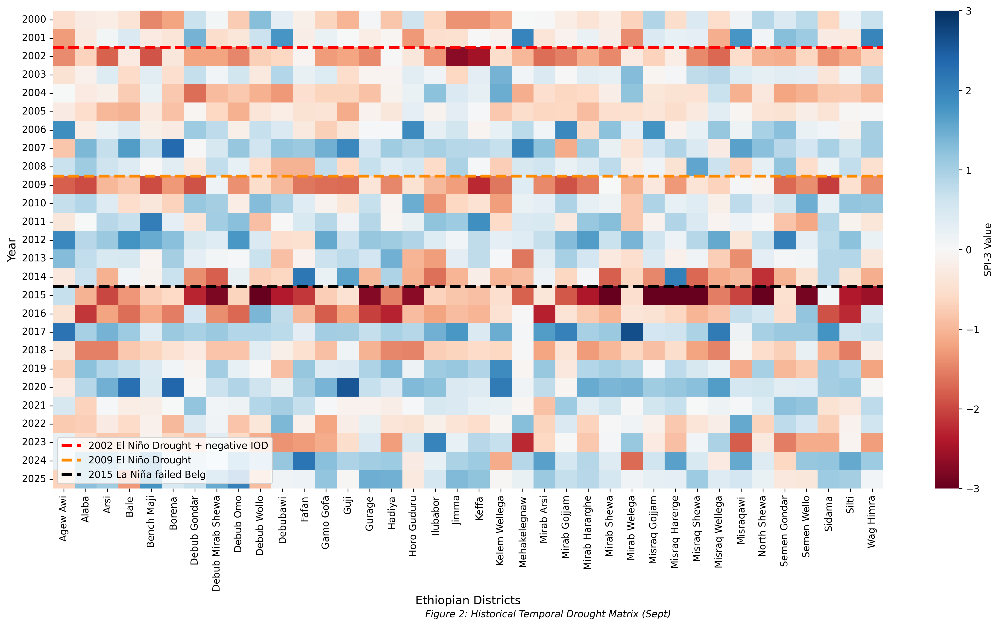

# AgriRisk-Africa 🌽☀️
**Multi-Scalar Drought Reanalysis & Parametric Insurance Modeling**

## 📖 Introduction
Agriculture in Africa is over 90% rainfed, making it highly vulnerable to climate-driven shocks. This project provides a high-resolution drought monitoring pipeline that moves beyond simple rainfall tracking. By integrating **CHIRPS satellite rainfall**, **ERA5-Land reanalysis**, and **GEOGLAM crop calendars**, we calculate standardized indices to identify "Flash Droughts" and soil moisture deficits that lead to crop failure.

## 🎯 Objectives
The primary goal of this study is to reduce **Basis Risk** (the gap between index triggers and actual crop loss) in parametric insurance:
1.  **Multi-Scalar Monitoring**: Calculate SPI (Rainfall), SPEI (Water Balance), and SSI (Soil Moisture) at the district level (Admin 2).
2.  **Integrated Modeling**: Develop the **Agricultural Reanalysis Index (ARI)**—a weighted composite index ($20\% SPEI + 50\% SSI + 30\% TCI$).
3.  **Validation**: Use ROC (Receiver Operating Characteristic) analysis to test index accuracy against historical disaster years (EM-DAT).
4.  **Spatial Correlation**: Map teleconnections between districts to help insurers diversify their risk portfolios.
 📊 Key Results
Superior Accuracy: The Agricultural Reanalysis Index (ARI) achieved an AUC of 0.798, significantly outperforming the traditional SPI (0.769) in predicting national disaster years.
Soil Lag Discovery: Analysis shows that root-zone soil moisture (SSI) typically lags atmospheric stress (SPEI) by 30–45 days, providing a critical early warning window for food security interventions.
Thermal Impact: Heat stress (TCI) was found to have a stronger negative correlation with plant health (r=−0.79) than rainfall alone.
🗺️ Visualizations
1. Multi-Layer Drought Map (Folium)
This interactive map allows users to toggle between SPI, SPEI, and SSI to see how drought moves from the atmosphere into the soil.
View Output: outputs/maps/Ethiopia_Drought_MultiLayer_2015_10.html
2. District Correlation Matrix
A Spearman-ρ heatmap showing how drought risk is synchronized across different planting-season groups.

3. Integrated Stress Heatmap
Visualizing systemic drought years (2002, 2009, 2015) across 3,800 districts.

Methodology Note: Standardized indices are calculated using Gamma-CDF (for SPI/SSI) and Log-Logistic (for SPEI) distributions, ensuring a score of -1.0 universally represents the 15.9th percentile (WMO Moderate Drought).
