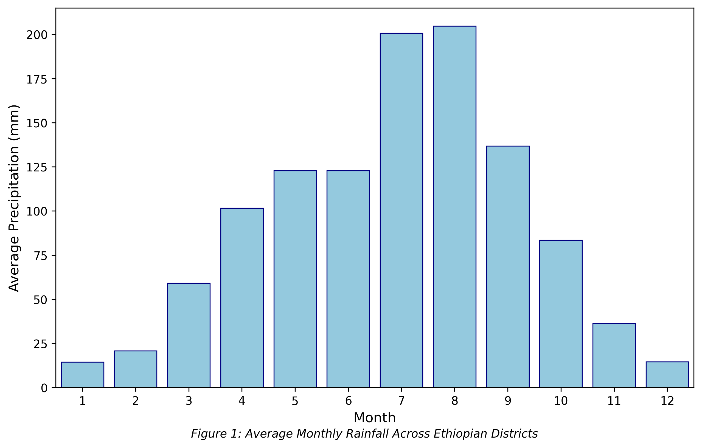
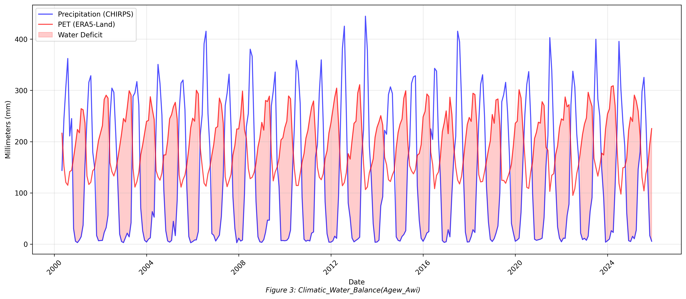
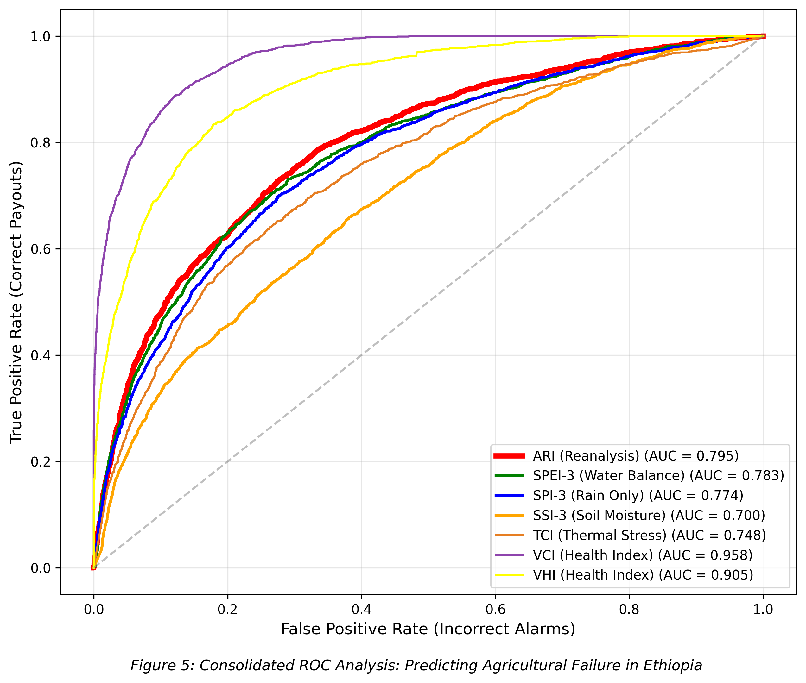
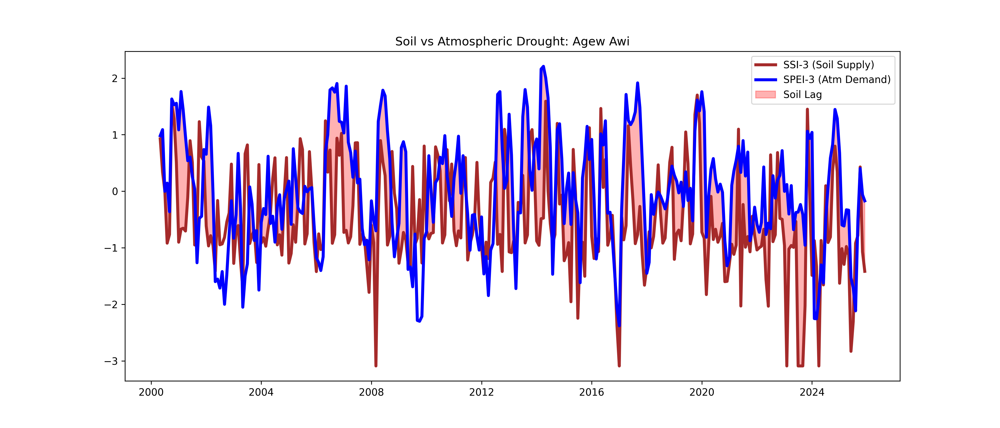

# Ethiopia Agricultural Drought Reanalysis (2000 - 2025)

High-Resolution District-Level Drought Monitoring for Parametric Insurance

📌 Project Objective
Agriculture in Ethiopia is 94% rainfed, with production concentrated in the Central Highlands. This study provides a high-resolution (ADM2/District level) agricultural drought analysis focusing on the Kiremt rains (June–September) which support the critical Meher harvest.
The goal is to develop and validate the Agricultural Reanalysis Index (ARI) a multi-indicator tool designed to reduce "Basis Risk" in parametric insurance by integrating atmospheric demand, soil moisture supply, and thermal stress.

🛠 Methodology & Indices
The analysis processes 25 years of climate and satellite data to calculate five distinct drought dimensions:

1. Standardized Precipitation Index (SPI-3)
Data: CHIRPS (5km resolution).
Method: Fits 3-month rolling rainfall to a Gamma Distribution.
Key Feature: Includes the Thom Adjustment to handle "Zero-Rain" months in arid regions like Afar, ensuring mathematical validity in probability scores.

2. Standardized Precipitation Evapotranspiration Index (SPEI-3)
Data: CHIRPS (Rainfall) - ERA5-Land (PET).
Method: Measures Climatic Water Balance (D=P−PET) fitted to a Log-Logistic (Fisk) Distribution.
Significance: Identifies "Flash Droughts" driven by extreme heat rather than just rainfall deficits.

3. Standardized Soil Index (SSI-3)
Data: ERA5-Land Root-zone soil moisture (7–28 cm).
Method: Standardizes the actual water available to plant roots against historical baselines.
Insight: Used to identify the 1-2 month lag between atmospheric drought and physical agricultural impact.

4. Satellite Health Indices (VCI, TCI, VHI)
VCI (Vegetation Condition Index): Normalizes NDVI greenness.
TCI (Thermal Condition Index): Measures Land Surface Temperature (LST) stress.
VHI (Vegetation Health Index): A 50/50 blend of moisture and temperature stress.

5. Agricultural Reanalysis Index (ARI) - The "Master" Trigger
The study evolves through three integrated iterations:
IADI: 0.4 × SPEI + 0.6 × SSI (Balanced Atmosphere/Soil).
IASI: 0.2 × SPEI + 0.3 × SSI + −0.5 × TCI_Z (Heavily weighted for thermal stress).
ARI (Final): Rolling3M(0.2×SPEI+0.5×SSI_Root+0.3×TCI_Z).

📈 Visual Outputs & Results
1. Rainfall Seasonality
The analysis confirms a "unimodal" rainfall pattern, justifying the study's focus on the June-September window for national food security.

3. Historical Drought Matrix
The SPI-3 heatmap highlights systemic drought years (2002, 2009, 2015) where nearly all districts simultaneously experienced severe rainfall deficits.

5. Climatic Water Balance (The "Scissors" Plot)
In districts like Agew Awi, atmospheric demand (PET) exceeds water supply for approximately nine months of the year, leaving a narrow window for crop growth.

7. Thermal Stress Correlation
Correlation analysis proves that Land Surface Temperature (LST) has a stronger negative impact on plant health (-0.79) than rainfall has a positive impact (0.57).
.png)

9. Model Validation (ROC Analysis)
The ARI achieved an Accuracy (AUC) of 0.798, outperforming the traditional SPI (0.769). This validates the ARI as the most reliable tool for triggering insurance payouts while minimizing Basis Risk.

11. Soil Moisture Lag
The comparison between SSI-3 and SPEI-3 shows that soil moisture often lags atmospheric demand by 1-2 months, providing a critical early warning window for agricultural intervention.

🖥️ Interactive Analysis
The project includes an interactive Folium Multi-Layer Map. This tool allows users to toggle between different indices (ARI, SPI, SSI, VHI) to see how they performed spatially during major disaster years like the 2015 El Niño.
🔗 View Interactive Ethiopia Drought Map (HTML) (Download and open in browser)

🚀 Technical Requirements
Language: Python 3.x
Libraries: geopandas, pandas, scipy (for Gamma/Fisk fitting), matplotlib, seaborn, sklearn (for ROC/AUC), folium.
Data Structure: Requires a master_df.csv containing columns for precip_mm, pet_mm, soil_7_28cm, ndvi, and lst_c.

📚 References
Vicente-Serrano et al. (2010): SPEI Methodology.
Funk et al. (2015): CHIRPS Data Usage.
Thom (1966): Gamma distribution adjustments for zero-rainfall.
Vroege et al. (2021): Satellite support for crop insurance.
